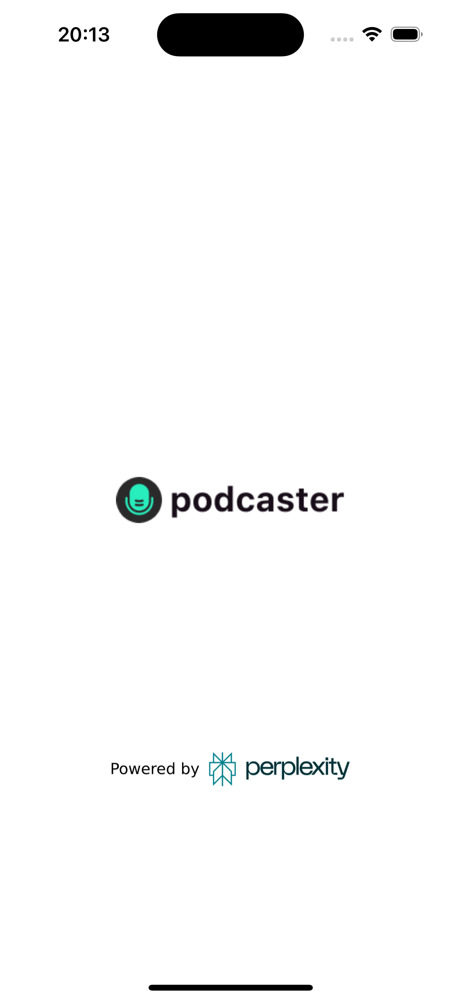
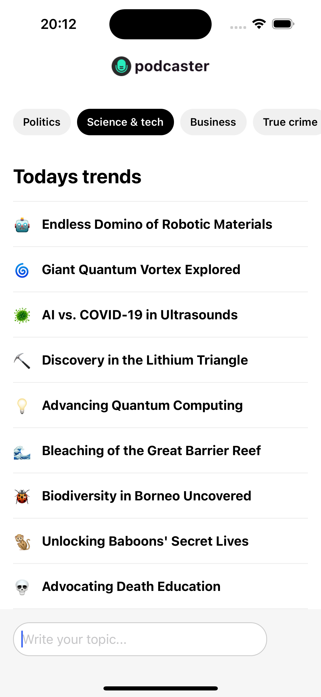
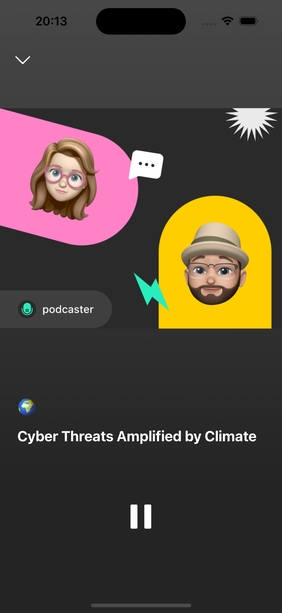
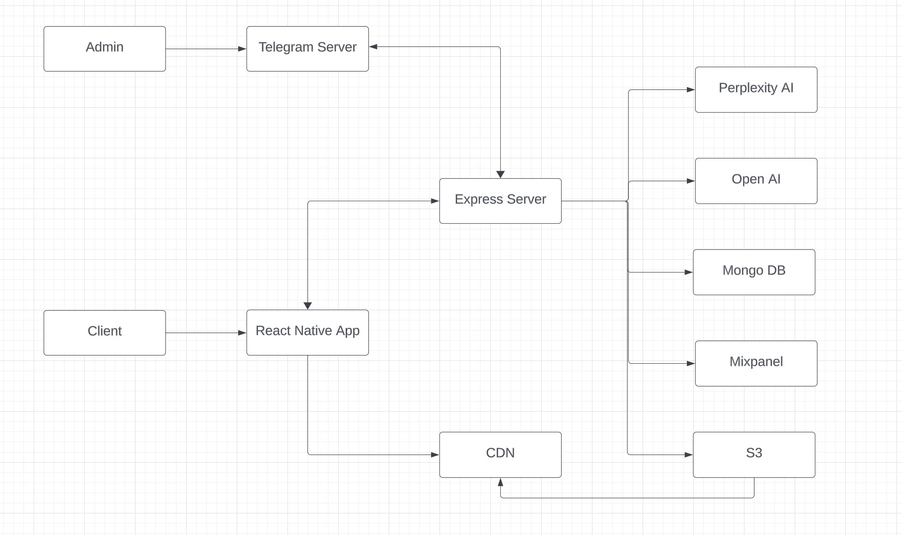

# Podcaster - Real Time Podcasts

## Description

Podcaster creates custom podcasts in real-time on any user-requested topic, in only 5 seconds, using the most advanced AI model from OpenAI, Anthropic AI, and Perplexity AI. It also leverages 7 categories with 10 pre-generated instantly available podcasts, that update/regenerate each 24 hours.

### Review

<!-- 

    

        <h3>Loading Screen:</h3>
        
    

    

        <h3>Main Screen:</h3>
        
    

    

        <h3>Podcast Screen:</h3>
        
    

    

        <h3>Video Demo:</h3>
        <video controls>
            <source src="demo.mp4" type="video/mp4">
            Your browser does not support the video tag.
        </video>
    

 -->

|  |  |  |
| :----------------------------------: | :----------------------------: | :----------------------------------: |
|          **Loading Screen**          |        **Main Screen**         |          **Podcast Screen**          |

### Video Demo

## Getting Started

### Prerequisites

-   Node.js should be installed on the machine.

### Installation

-   **Backend**: navigate to the “www” folder, install the dependencies (`npm install`)
-   **Frontend**: navigate to the app folder, install the dependencies (`npm install`)

### Environment Variables

#### Backend (/www):

**Required**:

-   `open_ai_token`: OpenAI API key
-   `mongodb_connection_url`: MongoDB connection URL
-   `perplexity_ai_token`: Perplexity API key
-   `PORT`: backend server port
-   `server_url`: URL of the server, including the port
-   `NODE_ENV`: “production” or “dev”
-   `spaces_access_key`: aws-sdk API compatible access key
-   `spaces_secret_access_key`: aws-sdk API compatible secret access key

**Optional**:

-   `labs_api_key`: 11Labs API for better podcast sound capabilities
-   `anthropic_ai_token`: Antropic API key. Sometimes it generates better podcasts than OpenAI, depending on the scenario
-   `dupdub_api_key`: DupDub API key used for animated podcast video generation
-   `cdn_url`: content delivery network URL used to get images of of the podcast co-hosters for video generation

## Usage

Firstly, start the backend server by navigating to “www” folder and running `npm run dev`. Then, start frontend by navigating to “app” folder and running `npm run start`. Once both successfully start, select an environment to run the application: iOS/Android device, web or simulator.

### High-level application diagram:

## Built with

### Backend:

`express`, `@anthropic-ai/sdk`, `ai`, `aws-sdk`, `axios`, `compression`, `cors`, `dotenv`, `elevenlabs`, `mixpanel`, `mongoose`, `node-cron`, `openai`, `telegraf`, `throttle`, `uuid`, `ws`

### Backend devDependencies:

`eslint`, `nodemon`

### Frontend:

`axios`, `expo`, `expo-av`, `expo-constants`, `expo-linear-gradient`, `expo-linking`, `expo-router`, `expo-splash-screen`, `expo-status-bar`, `react`, `react-dom`, `react-native`, `react-native-safe-area-context`, `react-native-screens`, `react-native-use-websocket`, `react-native-web`

### Frontend devDependencies:

`@babel/core`

## Contact

-   [LinkedIn](www.linkedin.com/in/maksym-bidnyi)
-   Email: mbidnyj@gmail.com
